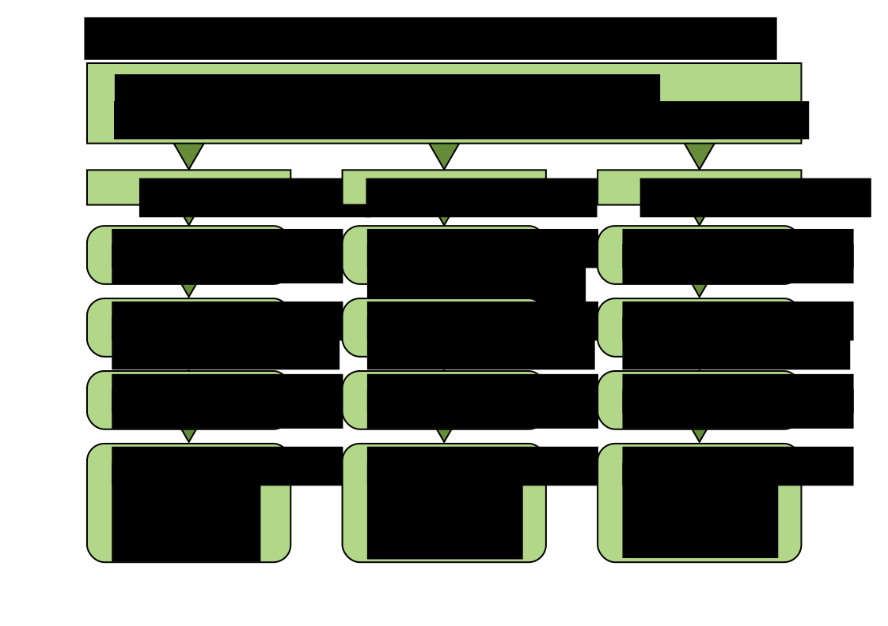

# Datenanalyse in Python

## Kontakt

Dr. Kristian Rother ([krother@academis.eu](mailto:krother@academis.eu))

## Ziele

Nach diesem Kurs kannst Du:

* einfache Python-Programme schreiben
* nützliche Python-Module für Grafik, Webrecherche etc. verwenden
* Daten analysieren
* Daten visualisieren
* ein einfaches Machine-Learning-Modell bauen
* eine eigene Webseite in Python entwickeln

## Kursmaterialien

* [Python-Basics](https://krother.gitbooks.io/python-3-basics-tutorial/content/de/)
* [Python-Referenz](https://www.gitbook.com/book/krother/python-3-reference/details)
* [Python-Module](https://www.gitbook.com/book/krother/python-3-module-examples/details)

## Kursübersicht

### 1. Python-Grundlagen

* Erste Schritte
* Dateien lesen und schreiben
* Module
* Funktionen
* Dictionaries

### 2. Datenanalyse

* Einführung in pandas
* Datenvisualisierung
* Datenaufbereitung
* Webseiten herunterladen

### 3. Schreiben größerer Programme

* Klassen
* Maschinelles Lernen
* Textprozessierung
* Best Practices
* Wiederholung und Ausblick

## Das Abschlußprojekt

zum Abschluß des ABV-Kurses gehört das Abschlußprojekt, also eine eigenständige Programmieraufgabe. Dabei bedeutet *'eigenständig'* vor allem, dass Du selbst etwas programmierst, das nicht Bestandteil der Übungsaufgaben war. Natürlich dürft Ihr Euch Code aus den bisherigen Programmen *'ausleihen'*.

Ein Richtwert für den zeitlichen Aufwand ist 15 Stunden.

Anforderungen an die Schwierigkeit der Aufgabe oder gar die Länge des abzugebenden Codes gibt es keine.

### Abgabekriterien

Um den Stoff des Kurses im Projekt abzubilden, sollte das Programm folgende Kriterien erfüllen:

* Das Programm ist (zumindest teilweise) in Python geschrieben sein.
* Das Programm verwendet mindestens ein Modul.
* Das Programm enthält eine selbst geschriebene Funktion.
* Das Programm ist auf GitHub abgelegt.

### Abgabe

Für die Abgabe bereite bitte eine README-Datei mit folgendem Inhalt vor:

* Name des Projekts
* Namen aller am Projekt beteiligten Personen
* e-Mail-Adressen der Autoren
* Kurzbeschreibung (ein Absatz, der gerne als "Werbetext" geschrieben sein darf)
* das Programm in einer lauffähigen Version (dazu gehören der Programmcode sowie alle nötigen Daten, Bilder usw.)
* Quellenangaben zu Dateien, die Du nicht selbst erstellt hast (insbesondere urheberrechtlich geschütztes Material)
* Wenn Du Dein Programm anderen zur Verfügung stellen möchtest, kannst Du z.B. folgenden Satz einbauen: **"Der Programmcode ist unter den Bedingungen der MIT-Lizenz nutzbar"**. 

Zum Einreichen verschickst Du einen Link zu einem GitHub-Repository an `krother@academis.eu`.

### Bewertung

Die Bewertung ist ein `Boolean`. Es gibt nur *bestanden* uns *nicht bestanden*. 

Ich werde Dein Programm ausprobieren und sicherstellen, dass es funktioniert. Ich schicke Euch ein kurzes Feedback zum Code und der Zedat eine Nachricht zum erfolgreichen Abschluß.

**Ich freue mich auf Eure Programme!**

## Wie geht's weiter?

## Lizenz

Diese Materialien sind unter der MIT-Lizenz verfügbar. Details findest Du in der Datei `LICENSE.TXT`.
