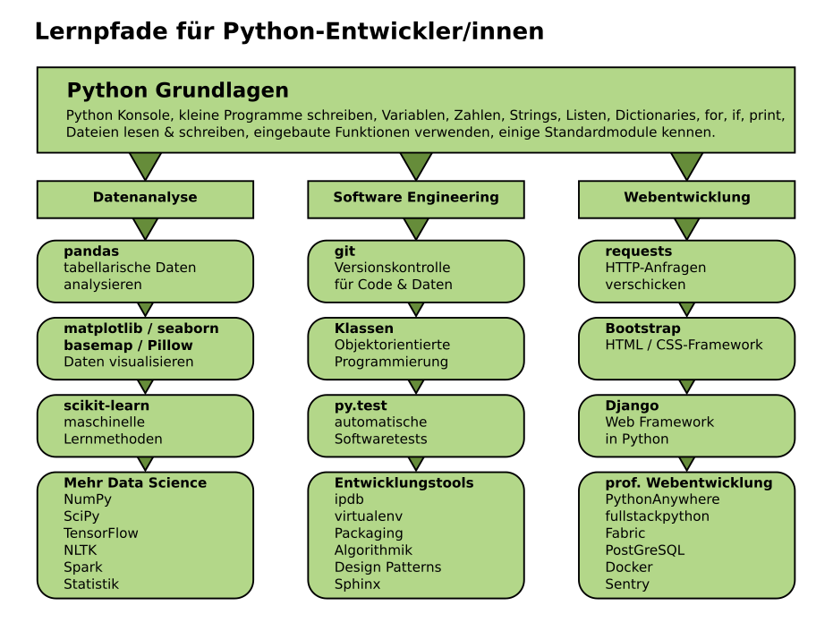

# Datenanalyse in Python

## Kontakt

Dr. Kristian Rother ([krother@academis.eu](mailto:krother@academis.eu))

# Das Abschlußprojekt

zum Abschluß des ABV-Kurses gehört das Abschlußprojekt, also eine eigenständige Programmieraufgabe. Dabei bedeutet *'eigenständig'* vor allem, dass Du selbst etwas programmierst, das nicht Bestandteil der Übungsaufgaben war. Natürlich dürft Ihr Euch Code aus den bisherigen Programmen *'ausleihen'*.

Ein Richtwert für den zeitlichen Aufwand ist 15 Stunden.

Anforderungen an die Schwierigkeit der Aufgabe oder gar die Länge des abzugebenden Codes gibt es keine.

## Projektideen

Falls Du selbst noch keine Idee für ein Projekt hast, findest Du hier einige Vorschläge:

### 1. Datenanalyse

Nimm Dir einen Datensatz. Lies die Daten ein, fasse sie zusammen, erstelle aussagekräftige Diagramme und nimm Dir Zeit, diese etwas aufzuhübschen.

Daten findest Du im Dokument [*Datenquellen für den Unterricht*](https://github.com/krother/academis/blob/master/posts/python/datenquellen_DE.md)

### 2. Machine Learning

Versuche Dich an einer Vorhersage mit `scikit-learn`. Erkunde die Daten zuerst von Hand, probiere dann einige Vorhersageverfahren aus und versuche, die Parameter zu optimieren. 

Eine Menge Datensätze mit Aufgabenbeschreibungen findest Du auf [Kaggle](http://kaggle.com)

### 3. Challenges aus den Kursmaterialien

In den Kursmaterialien finden sich mehrere größere Programmieraufgaben. Suche Dir eine aus und programmiere sie von Anfang bis Ende. Nimm Dir die Zeit, den Programmcode aufzuräumen, besonders wenn Du viele Funktionen verwendest.

Stöbern kannst Du auf [Gitbook](http://gitbook.com/@krother)

### 4. Eine Webseite mit Django

Mit dem [DjangoGirls-Tutorial](http://tutorial.djangogirls.org/) kannst Du eine komplette Blog-Webseite entwickeln und im Netz veröffentlichen. Das Tutorial wurde schon von 10000 Leuten genutzt und ist sehr ausführlich.

### 5. Ein Spiel schreiben

Verwende die Bibliotheken `pygame` oder [`tilegamelib`](https://github.com/krother/tilegamelib), um ein kleines Spiel mit Grafik zu schreiben. Es kann ruhig ein sehr einfaches Spiel sein (Reversi, Vier Gewinnt usw.). 

## Abgabekriterien

Um den Stoff des Kurses im Projekt abzubilden, sollte das Programm folgende Kriterien erfüllen:

* Das Programm ist (zumindest teilweise) in Python geschrieben sein.
* Das Programm importiert mindestens ein Modul.
* Das Programm enthält eine selbst geschriebene Funktion.

## Abgabe

Für die Abgabe bereite bitte eine README-Datei mit folgendem Inhalt vor:

* Name des Projekts
* Namen aller am Projekt beteiligten Personen
* e-Mail-Adressen der Autoren
* Kurzbeschreibung (ein Absatz, der gerne als "Werbetext" geschrieben sein darf)
* das Programm in einer lauffähigen Version (dazu gehören der Programmcode sowie alle nötigen Daten, Bilder usw.)
* Quellenangaben zu Dateien, die Du nicht selbst erstellt hast (insbesondere urheberrechtlich geschütztes Material)
* Wenn Du Dein Programm anderen zur Verfügung stellen möchtest, kannst Du z.B. folgenden Satz einbauen: **"Der Programmcode ist unter den Bedingungen der MIT-Lizenz nutzbar"**. 

Zum Einreichen verschickst Du das Programm per Mail oder einen Link zu einem GitHub-Repository an `krother@academis.eu`.

## Bewertung

Die Bewertung ist ein `Boolean`. Es gibt nur *bestanden* uns *nicht bestanden*. 

Ich werde Dein Programm ausprobieren und sicherstellen, dass es funktioniert. Ich schicke Euch ein kurzes Feedback zum Code und der Zedat eine Nachricht zum erfolgreichen Abschluß.

**Ich freue mich auf Eure Programme!**

## Wie geht's weiter?

## Lizenz

Diese Materialien sind unter der MIT-Lizenz verfügbar. Details findest Du in der Datei `LICENSE.TXT`.
