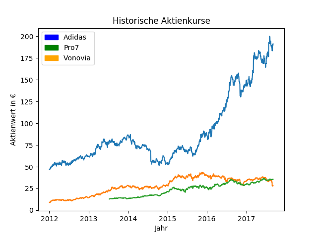

# AktienkursAnalyst 

**von Jeremy Zeisler (jeremy.zeisler@googlemail.com) und Tobias Flörchinger (to-flor@web.de)**

*Version vom 06/09/2017*

## Programmidee

Der Grundgedanke des Programms ist es Aktienkurse abzurufen, graphisch darzustellen und zu analysieren bzw. zu prognostizieren. Hierfür werden bespielhaft die DAX30 Unternehmen und für die Analysen bzw. Prognosen die Adidas Aktie herangezogen.

## Aufbau des Programms

Der erste Teil des Programms liest die Daten der Aktienkurse aus der Yahoo Datenbank aus und lädt sie herunter, wobei für jede Aktie eine CSV Datei entsteht. Daraufhin werden die Dateien analysiert und die Kurse der drei Unternehmen, welche sich im monatlichen Schnitt des Aktienwertes am besten entwickelt haben, graphisch ausgeben. Anschließend folgen einige statistische Analysen am Beispiel der Adidas Aktie. Ziel ist es Vorhersagen über den Aktienkurs treffen zu können. Dazu wird mit Hilfe von Informationskriterien, wie dem Autokorrelogramm, dem partiellen Autokorrelogramm, BIC, AIC und MSE, ein durch differenzieren stationärer und möglichst zweckmäßiger ARIMA(p,1,q) Prozess gesucht, welcher Prognosen für den Wert der Akite in kommenden Perioden ausgeben kann.

## Nutzen und Nutzung

In dem aktuellen Zustand löst das Programm noch kein klar benanntes größeres Problem, bildet allerdings eine Code Basis für finanzwissenschaftliche Fragestellungen. Durch jeweilige Erweiterungen lässt es sich für Portfolioanalysen, die Anwendung Sigma-mue-Theorie, Trading und weitere Aktienkursanalysen einsetzen.

Der Programmcode ist unter den Bedingungen der MIT-Lizenz nutzbar.

## Hinweise und Quellen

* bei Ausführung des Programms entstehen 30 CSV Dateien im Speicherort des Programms.
* das Downloaden der Aktienkurse kann zum Teil lange dauern, da unter umständen mehrfach
  zugegriffen werden muss bis die Aktienkurse erfasst werden.
* Schätzungen des ARIMA Prozesses benötigen mitunter hohe Rechenleistung
* die Schätzung es MSE basiert auf folgener Quelle: https://machinelearningmastery.com/arima-for-time-seriesforecasting-with-python/
