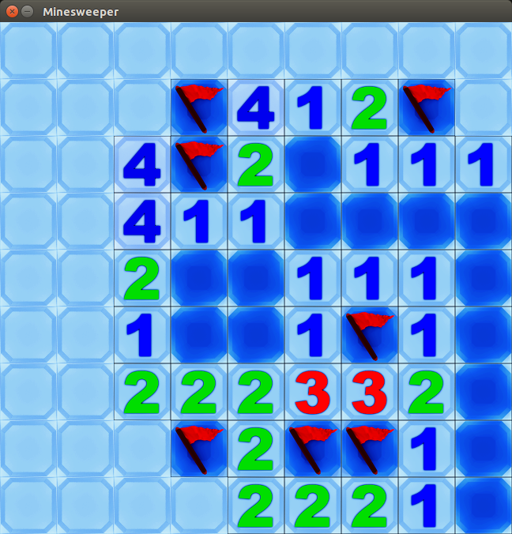

# Minensuche

**von Benny Henning**

## Beschreibung:

Ein kleines, funktionierendes Suchspiel nach Vorbild des allzu bekannten Spieles: Minesweeper.

Das Ziel des Spiels ist es die Minen zu finden ohne sie zu zünden und alle minenlosen Felder aufzudecken.

Zum Starten des Spiels wird das Starten der Datei "main.py" ausgeführt.
Dieses Programm wurde für Python 3.5 und neuer programmiert und getestet.

## Quellen:

Kompletter Ordner Tiles - [https://opengameart.org/content/minesweeper-tile-set](https://opengameart.org/content/minesweeper-tile-set); Stand: 02.08.2017; Author: eugeneloza

## Lizenz

Der Programmcode ist unter den Bedingungen der MIT-Lizenz nutzbar.

