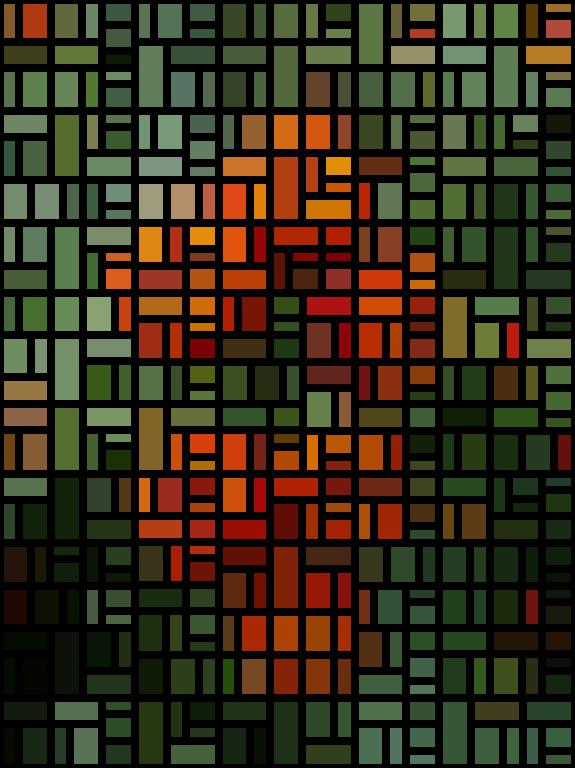

# Mondrian 2.0

**von Christin Jacobsen**
 

Ein Programm, das ausgewählte Bilder im Stil von Piet Mondrian zur Zeit des Neo-Plastizismus erscheinen lässt. Bekanntestes Werk der Reihe und Inspiration für dieses Projekt ist seine *"Komposition mit Rot, Gelb, Blau und Schwarz"* aus dem Jahre 1921. 

Anders als bei Mondrians Werken werden jedoch nicht ausschließlich die Primärfarben sowie Weiß und Schwarz verwendet, sondern die farbliche Gestaltung des Original-Bildes beibehalten.

Von leicht strukturiert bis zur kompletten Abstraktion - der Anwender varriert die Größe der Rechtecke, Strichdicke der Begrenzungslinien und entscheidet darüber, ob die Komposition dem Goldenen Schnitt folgen soll oder nicht.
 

*Anmerkung: Das ursprünglich eingeschickte Bild habe ich durch ein eigenes ersetzt, um urheberrechtliche Probleme zu vermeiden. (KR)*
